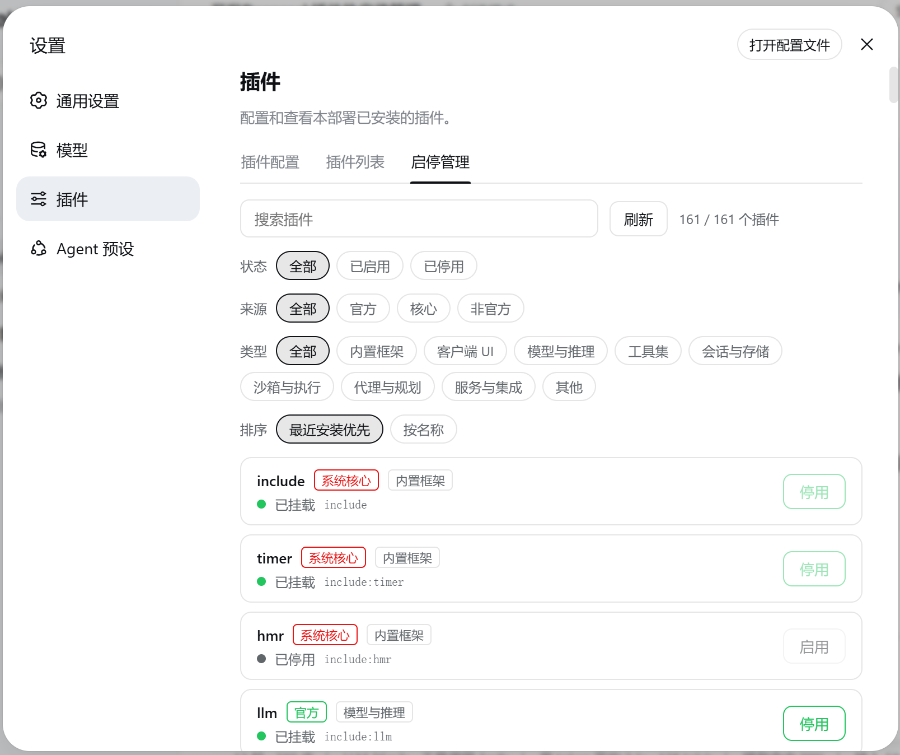

# dsh-plugin-hot-toggle

Hot-toggle any installed plugin from the DeepSeek Harness Web settings page (Plugins → 启停管理): stop or start a Cordis Loader entry in-process with instant effect and no DSH restart — the state persists across restarts.

[中文文档](./README.zh.md) | English

<p align="center">
  <a href="https://github.com/topics/dsh-plugin"></a>
  <a href="https://www.npmjs.com/package/dsh-plugin-hot-toggle"></a>
  <a href="https://github.com/5102a/dsh-plugin-hot-toggle/actions"></a>
  <a href="./LICENSE"></a>
</p>

## Features



- **Hot toggle**: calls the official Cordis Loader `Entry.update({ disabled })` — disabling disposes the plugin fiber, enabling re-imports and starts it, all in-process with instant effect. No DSH restart needed.
- **Persistent**: the toggle state is written to the profile patch layer (`$DSH_HOME/profiles/<profile>/cordis.patch.yml`) and hot-applied by the official HMR watcher on save — **survives restarts**.
- **Safety guard**: system-core entries (`include`, `cordis:*`, loader/hmr/timer, the dynamic-plugin host) cannot be toggled and are marked 「系统核心」.
- **Multi-dimensional filters** (combinable):
  - State: all / enabled / disabled
  - Source: all / official / core / community (community = a matching directory under `$DSH_HOME/plugins`)
  - Type: builtin framework / client UI / LLM / tools / session & storage / sandbox & exec / agent & planning / services & integration / other
  - Search + live count (filtered / total)
- **Sorting**: recent-first (community plugins ahead) or by name.

## Installation

### From a local checkout (development)

```sh
dsh plugin --profile web add ./dsh-plugin-hot-toggle
```

### From npm (after publish)

```sh
dsh plugin --profile web add dsh-plugin-hot-toggle
```

### From git (after publish)

```sh
dsh plugin --profile web add github:5102a/dsh-plugin-hot-toggle
```

After installation, start DSH (or let HMR apply it) and open **Settings → Plugins → 启停管理**.

## Platform support

The plugin runs on **Windows, macOS, and Linux** — the three platforms DeepSeek Harness itself supports.

| Concern | Guarantee |
| --- | --- |
| Host half | All filesystem paths go through `node:path` (`join`/`dirname`) and `fileURLToPath`; no hardcoded separators |
| Persistence | Patch-layer writes use `readFileSync`/`writeFileSync(…, 'utf8')` with paths derived from the Loader include |
| HTTP API | `/plugin-hot-toggle/api/*` is a URL route — platform-independent |
| Client half | Pure browser `fetch` + React; no `process.platform`/`navigator.platform` branches |
| Build | `scripts/build.mjs` resolves paths from `import.meta.url` via `fileURLToPath` + `join` |
| Dev tooling | Chrome/Edge discovery honors `CHROME_PATH`/`CHROME_BIN` or a cross-platform candidate list; `DSH_URL` overrides the target origin |
| CI | GitHub Actions matrix: **ubuntu + windows + macos** × Node 18/20/22 |

## How it works

```
┌─────────────────────────────┐         ┌──────────────────────────────┐
│  Web (client half)          │  fetch  │  Node (host half)             │
│  settings.plugins.tab       │ ──────► │  /plugin-hot-toggle/api/*     │
│  「启停管理」tab             │  JSON   │  ┌──────────────────────────┐ │
│  - list + filters + sort    │ ◄────── │  │ ctx.loader.entries()     │ │
│  - toggle buttons           │         │  │ entry.update({disabled}) │ │
└─────────────────────────────┘         │  │ → fiber dispose / start  │ │
                                        │  └──────────────────────────┘ │
                                        │  ┌──────────────────────────┐ │
                                        │  │ persistence: write       │ │
                                        │  │ cordis.patch.yml → HMR   │ │
                                        │  └──────────────────────────┘ │
                                        └──────────────────────────────┘
```

- **Node half** uses only public seams (`loader`, `webServer`, `dshHomePath`) — zero DSH core changes. `webServer` is injected dynamically, so TUI/headless surfaces never pend.
- **Web half** talks to the Node half over a same-origin HTTP API; mutating requests carry a same-origin check (missing Origin / cross-origin → 403).
- **Client bundle** is generated from `src/client.js` by a zero-dependency build script (`node scripts/build.mjs`) and committed to the repo, so git/npm installs need no build step.

## Project layout

```
dsh-plugin-hot-toggle/
├── package.json         # dsh.bundle declaration + peerDependencies + exports
├── index.d.ts           # Host half type declarations
├── index.js             # Node half: loader list/toggle + webServer HTTP API
├── cordis.patch.yml     # bundle layer: inserts the plugin row
├── src/client.js        # Web half source (React)
├── lib/client.js        # Web half build artifact (generated, do not edit)
├── scripts/build.mjs    # zero-dep client bundle build
├── scripts/screenshot.mjs   # headless-Chrome UI screenshot (CDP, zero deps)
├── scripts/verify-render.mjs # verify the 启停管理 tab rendered
├── scripts/debug-dom.mjs    # DOM/slot debugging helper
├── tests/patch.test.js  # unit tests (node:test)
└── .github/workflows/ci.yml  # CI: build + artifact freshness + tests
```

## API

| Method | Path | Body | Returns |
| --- | --- | --- | --- |
| GET | `/plugin-hot-toggle/api/list` | — | `{ entries: PluginEntry[] }` |
| POST | `/plugin-hot-toggle/api/setEnabled` | `{ entryId, enabled }` | `SetEnabledResponse` |

See [index.d.ts](./index.d.ts) for `PluginEntry` / `SetEnabledResponse`.

## Development

```sh
npm run build   # generate lib/client.js from src/client.js
npm test        # node:test unit tests
npm run check   # build + test in one step
```

## Publishing

```sh
npm run check && npm run build
npm publish
```

> The name `dsh-plugin-hot-toggle` was verified available with `npm view` before release.

## License

MIT — see [LICENSE](./LICENSE).
